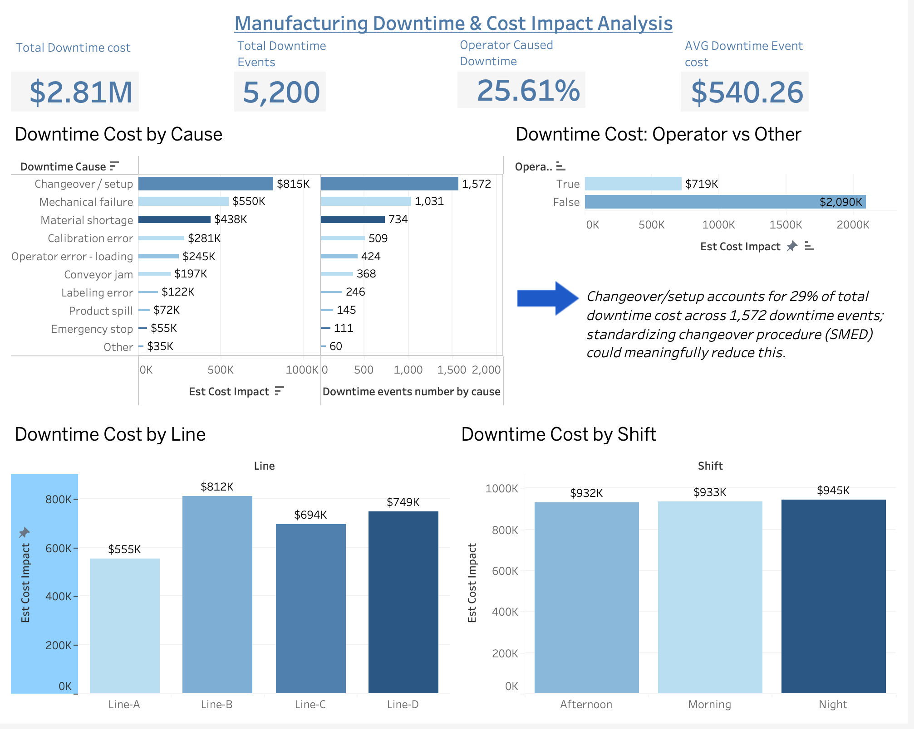

# Manufacturing Downtime & Cost Impact Analysis
An end-to-end data analytics project analyzing manufacturing downtime to identify the biggest cost drivers and uncover opportunities to improve operational efficiency.

**Interactive Tableau Dashboard:** [View Dashboard](https://public.tableau.com/app/profile/irina.sharapova3904/viz/Downtimedata_17846032507120/ManufactureDowntime)

---

## Project Overview

Manufacturing downtime directly impacts production efficiency and operating costs. This project analyzes **5,200 downtime events** across 4 production lines and 3 shifts over 6 months, to answer a question every manufacturing manager cares about: where is downtime actually costing us the most, and why?

The dataset was designed to simulate a realistic multi-line production environment, informed by prior hands-on project management experience in industrial manufacturing operations.

**Note:** Data is synthetic, generated to mirror realistic downtime patterns, cost distributions, and operational structure, not sourced from a real company.

Using **SQL** for data preparation and **Tableau** for visualization, I built an interactive dashboard that helps manufacturing managers monitor downtime trends, identify high-cost failure categories, and prioritize process improvements.

---

## Dataset

**Synthetic manufacturing dataset** modeled on realistic production downtime over **6 months**, containing **5,200 downtime events** across **4 production lines**.

Each record includes:

- Downtime cause
- Production line
- Shift
- Estimated cost impact
- Operator attribution
- Duration
- Event date

> **Note:** This dataset was created based on realistic manufacturing processes and informed by my previous experience managing engineering projects.

---

## Business Questions

This analysis answers the following questions:

- Which downtime causes generate the highest financial losses?
- How much downtime is operator-related versus systemic?
- Which production line experiences the highest downtime costs?
- Do certain shifts experience higher downtime costs?
- Where should improvement efforts be focused first?

---

## Tools & Technologies

- SQL
- Tableau
- Excel
- Data Cleaning
- Data Aggregation
- KPI Development
- Business Analysis

---
# Dashboard

**Interactive Tableau Dashboard:**  
https://public.tableau.com/app/profile/irina.sharapova3904/viz/Downtimedata_17846032507120/ManufactureDowntime

---

# 🔍 Key Insights

## 1 Changeover / Setup is the Largest Cost Driver

- **$815K** estimated downtime cost
- **1,572 downtime events**
- **29% of total downtime cost**

### Recommendation

Implement **SMED (Single-Minute Exchange of Dies)** principles to standardize and shorten equipment changeovers.

---

## 2 Most Downtime Cost Is Not Operator Related

Operator-caused downtime represents only **25.6%** of total downtime cost.

Approximately **74%** of downtime cost comes from equipment failures, process issues, and other operational causes.

### Recommendation

Prioritize equipment reliability and process improvements before focusing on operator training.

---

## 3 Production Line B Has the Highest Cost

| Production Line | Estimated Cost |
|----------------|---------------:|
| Line A | $555K |
| **Line B** | **$812K** |
| Line C | $694K |
| Line D | $749K |

### Recommendation

Conduct a root-cause analysis for Line B to identify recurring failures and improvement opportunities.

---

## 4 Downtime Costs Are Consistent Across Shifts

Morning, afternoon, and night shifts show similar downtime costs.

This suggests downtime is primarily driven by equipment and process issues rather than staffing differences.

---

# Business Recommendations

- Reduce changeover/setup time using SMED.
- Prioritize investigations on Line B.
- Improve preventive maintenance for mechanical failures.
- Continue monitoring operator-related events while focusing on higher-cost operational issues.
- Use KPI dashboards to track improvement initiatives over time.

---

# Skills

- SQL
- Data Cleaning
- Data Aggregation
- KPI Development
- Tableau Dashboard Design
- Manufacturing Analytics
- Data Storytelling
- Business Recommendations

---

# SQL Queries

The SQL queries used in this project can be found here:

➡️ **[View SQL Queries](queries/)**

---

## Author

**Irina Sharapova**

- LinkedIn: https://www.linkedin.com/in/irina-sharapova-design-and-define/
- Tableau Public: https://public.tableau.com/app/profile/irina.sharapova3904/viz/Downtimedata_17846032507120/ManufactureDowntime
- GitHub: https://github.com/irena-sharapova